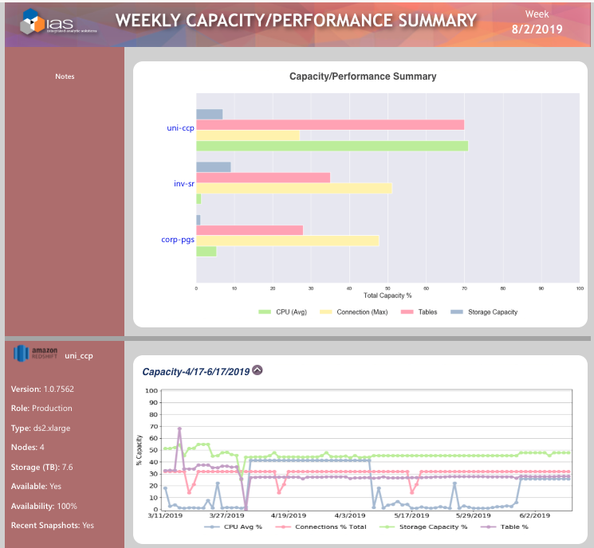
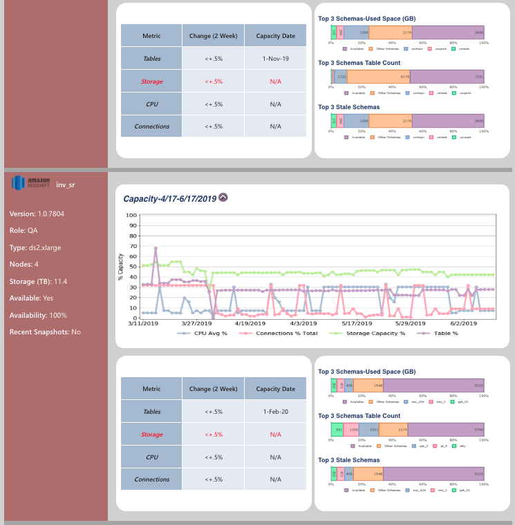
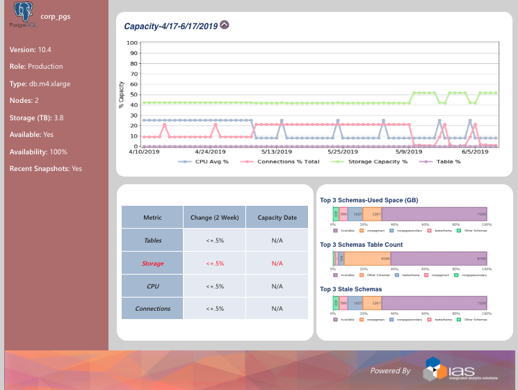

# Redshift monitoring and reporting

## Assumptions
​
- Python 3.7.3 is installed and properly configured.
- Required libraries are installed.
- User running the script has access to the folder - `/assets`.
- Folders `/graph_images` and `/assets` exist.

## Required libraries
​
- matplotlib v3.0.3 (`$sudo pip install matplotlib==3.0.3`)
- numpy v1.16.2 (`$sudo pip install numpy==1.16.2`)
- pandas v0.24.2 (`$sudo pip install pandas==0.24.2`)
- Pillow v7.0.0 (`$sudo pip install Pillow==7.0.0`)
- psutil v5.6.3 (`$sudo pip install psutil==5.6.3`)
- psycopg2 v2.8.3 (`$sudo pip install psycopg2-binary==2.8.3`)
- seaborn v0.9.0 (`$sudo pip install seaborn==0.9.0`)
​
## INSTALLATION
​
- Fill in the database (lines 12-16) and email (lines 99-101) credentials in `Main.py` file.
- Install all the required libraries. 
- Run `$python Main.py`.
​
## Usage
​
- When the program is executed, it connects to the database, and extracts data for generating graphs in the form of images.
- The program produces images in `/graph_images` and csv files in the default directory.
- It uses these files, and the html inside to send emails to respective email addresses after connecting to the smtp server. 
- When a new csv file is created in the above folder, its contents are read.
- The python file `Main_test.py` is for testing first half of the program i.e. if the program generates images or not.

## REFERENCES
​
N/A
